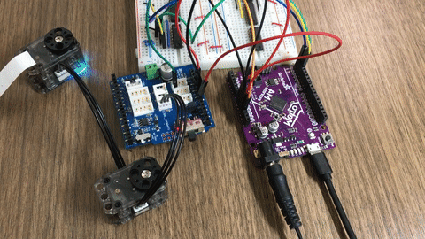

# xiaomotors
Interact XL320 with circuitpython and arduino  
Dynamixel protocal 2.0  
Full duplex uart to half duplex  
### hardware
- [Adafruit M4 Metro](https://learn.adafruit.com/adafruit-metro-m4-express-featuring-atsamd51)
- [Arduino Uno R3](https://docs.arduino.cc/hardware/uno-rev3)  
</a>
