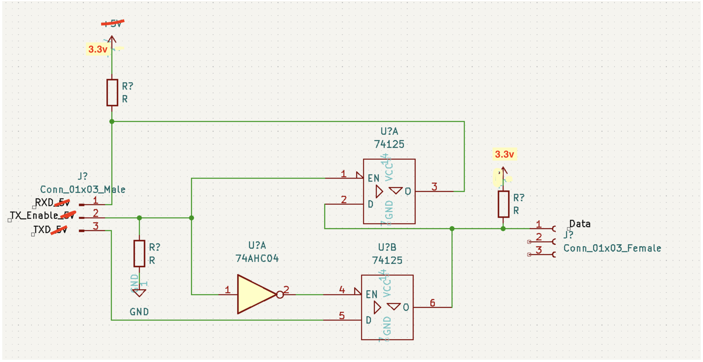

# xiaomotors
More information could be found in the wiki tab 
Interact XL320 with circuitpython 
Dynamixel protocal 2.0  

### hardware
- [Adafruit M4 Metro](https://learn.adafruit.com/adafruit-metro-m4-express-featuring-atsamd51)

</a>

### Full duplex uart to half duplex
The offical emanual suggest a 74LVC2G241 to do the conversion which I don't have. Good thing is that I have a 7404 and a 74125. They could be assembled to work just like a 74LVC2G241. This circuit could also do the level shift from 3.3v to 5v, or from 5v to 3.3, depends on the VCC voltage.   
</a>

### reference link list: 
- Motor XL320 https://emanual.robotis.com/docs/en/dxl/x/xl320/#torque-enable 
- Dynamixel Shield https://emanual.robotis.com/docs/en/parts/interface/dynamixel_shield/  
- Dynamixel Library https://github.com/hideakitai/Dynamixel 
- Dynamixel SDK https://github.com/ROBOTIS-GIT/DynamixelSDK 
- Arduino SoftSerial https://docs.arduino.cc/learn/built-in-libraries/software-serial 
- Dual buffer(tri-states) on the shield https://www.onsemi.com/pdf/datasheet/nc7wz241-d.pdf 
- https://www.adafruit.com/product/4768 
- https://www.hackster.io/news/spudworks-dynafeather-featherwing-makes-dynamixel-servo-control-from-a-feather-a-cinch-f9d9a931efad 
- https://github.com/hierophect/dynafeather 
- https://www.tindie.com/products/spudworks/dynafeather/ 
- http://www.forestmoon.com/Software/DynamixelIO/ 
- https://github.com/jumejume1/AX-12A-servo-library/blob/master/src/AX12A.h 
